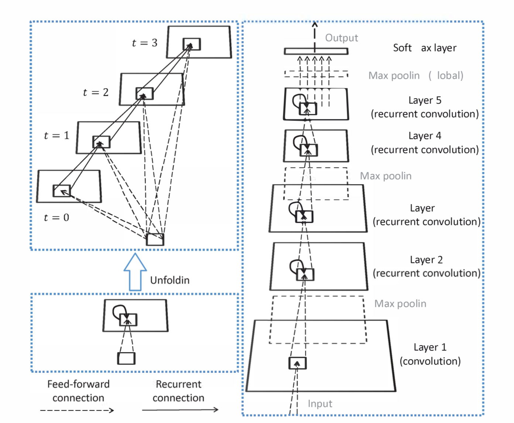
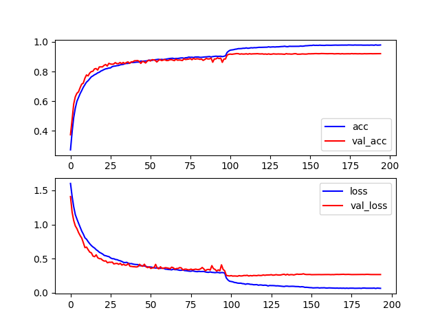

# RCNN IN Pytorch
Implementation of <http://xlhu.cn/papers/Liang15-cvpr.pdf>. 

###Requirements

Refer to requirements.txt

### Details

Here is the architecture of the model.

Refer to the paper below for more details.

####Note

the implementation is a little bit different from [the original paper](http://xlhu.cn/papers/Liang15-cvpr.pdf).

• Instead of LRN, using BN here and removing dropout layers except the last linear layer.

• As BN layers introduce extra parameters,  the feed-forward filter size in layer 1 is modified to 3 x 3.

• For simplification, using Tencorp (there exsits api in pytorch) for test here instead of the original nine crops.

#### How to train

usage: train.py [-h] [-n K] [-b BATCH_SIZE] [-e EPOCH] [-s SAVE_DIR]  [-l TRAINING_LOG]

Train RCNN

optional arguments:
  -h, --help       show this help message and exit
  -n K             the parameter K for RCNN
  -b BATCH_SIZE    the batch size in just one gpu, * GPU_COUNT
  -e EPOCH         the training epoch
  -s SAVE_DIR      the model parameters to be saved
  -l TRAINING_LOG  the logs to be saved

#### Results on cifar-10

With Data Augmentation

| Network  | No. of Parameters | Testing Error (%) |
| :------: | :---------------: | :---------------: |
| RCNN-96  |      0.67 M       |       7.65        |
| RCNN-128 |      1.19 M       |       7.42        |
| RCNN-160 |      1.86 M       |       7.31        |

#### Train procedure for RCNN-96

